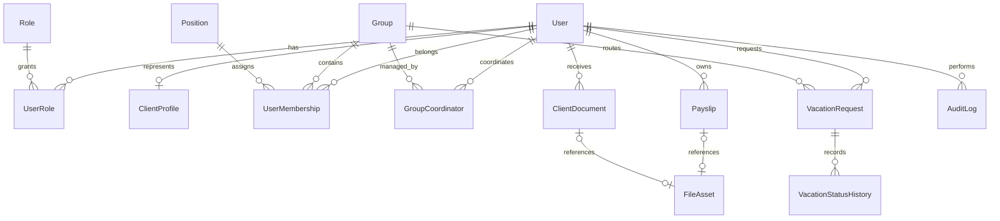

# Modelo relacional

## Modelo atual antes da migration

- `"User"` concentra identidade, senha, perfil, cargo e grupo como textos.
- `"EmployeeRequest"` mistura férias e solicitações de holerite.
- Repositories antigos usam SQL manual e criam tabela durante a execução.
- A exclusão em cascata de usuário pode apagar solicitações históricas.

## Modelo-alvo desta entrega

## Decisões

- `User` contém somente identidade, credencial, estado e timestamps.
- `ClientProfile` mantém os dados cadastrais do cliente e aponta para uma conta
  `User` com perfil `CLIENT`; clientes não recebem vínculo de grupo ou cargo.
- Perfis são N:N por `user_roles`; a API mantém um `role` principal no DTO para
  compatibilidade com o frontend.
- Grupo e cargo não são texto livre em usuário. O vínculo temporal fica em
  `user_memberships`.
- Coordenadores e grupos formam N:N em `group_coordinators`.
- Exclusão de usuário é lógica. Férias, holerites e auditoria usam `RESTRICT` ou
  `SET NULL`, nunca cascata destrutiva.
- Arquivos de holerite, IRPF e boleto ficam em armazenamento privado; o banco
  guarda somente metadados e `storageKey`.
- RH e Contabilidade publicam holerites e IRPF; boletos são publicados somente
  pela Contabilidade. O cliente tem acesso de leitura apenas aos próprios itens.

## Integridade e índices

- Unique: e-mail, código de perfil, nome/slug de grupo, nome de cargo,
  `(userId, roleId)`, `(userId, groupId)` para coordenadores e
  `(userId, year, month)` para holerites e um IRPF publicado por usuário/ano.
- Índices parciais: somente um vínculo primário ativo e um IRPF publicado por
  usuário/ano-base.
- Checks: mês/ano e valores de holerite, metadados de boleto/IRPF, período e
  quantidade de dias de férias.
- Índices de leitura: status + grupo + criação em férias; usuário + estado em
  holerites; entidade + data em auditoria.

## Dicionário resumido

| Entidade | Responsabilidade | Chaves e retenção |
|---|---|---|
| `User` | Identidade, credencial e estado | `email` único; inativação lógica |
| `roles` / `user_roles` | Perfis de autorização, incluindo `CLIENT` | N:N; chave composta |
| `client_profiles` | Nome completo, CPF, telefone e nascimento do cliente | `userId` e CPF únicos; CPF não é exposto integralmente pela API |
| `groups` / `positions` | Cadastros organizacionais | nomes únicos e estado ativo |
| `user_memberships` | Histórico de grupo e cargo | um vínculo primário ativo por usuário |
| `group_coordinators` | Grupos administrados por coordenador | chave composta `(userId, groupId)` |
| `vacation_requests` | Ciclo de férias | período válido, histórico e cancelamento |
| `vacation_status_history` | Trilha imutável de status | vinculada à solicitação |
| `payslips` | Holerite por competência | único por usuário/ano/mês |
| `client_documents` | IRPF e boletos Itaú publicados | proprietário, tipo, situação e arquivo privado |
| `file_assets` | Metadados do arquivo privado | `storageKey` único; sem URL pública |
| `audit_logs` | Ações administrativas e sensíveis | ator opcional, entidade e alterações |

## Migração

1. Fazer snapshot do PostgreSQL.
2. Executar `prisma migrate deploy` (fase expandir).
3. Executar `backend/prisma/reconciliation.sql`.
4. Liberar a API normalizada.
5. Observar erros, contagens e planos de consulta.
6. Somente em uma versão futura remover `User.role/cargo/grupo` e
   `EmployeeRequest`.

As colunas/tabela legadas permanecem nesta versão para rollback seguro. A
aplicação não realiza novos writes nelas.

### Rollback seguro

1. Interromper gravações da nova API.
2. Preservar um snapshot do estado pós-migration para investigação.
3. Reimplantar a versão anterior da aplicação, que continua lendo as colunas
   legadas preservadas.
4. Não executar `DROP` nas novas tabelas enquanto houver dados criados após a
   migração.
5. Se o rollback ocorrer após novas férias, holerites ou documentos de cliente,
   exportar os registros e preservar os PDFs privados antes de retomar a versão anterior.

## Alternativas rejeitadas

- Manter `grupo` e `cargo` como texto: produz duplicidade, erros de grafia e
  autorização inconsistente.
- Armazenar todas as solicitações numa tabela genérica: férias e holerites têm
  ciclos e restrições incompatíveis.
- Apagar usuário com cascata: destrói histórico legal e operacional.
- Confiar no grupo gravado no JWT: permissões antigas continuariam válidas até a
  expiração do token.
